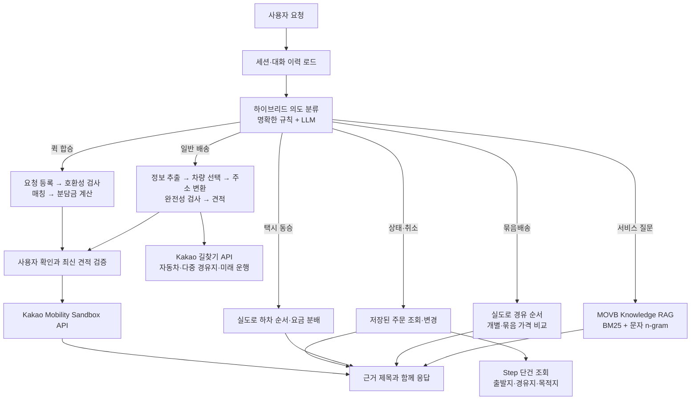

# MOVB — AI 모빌리티 운영 서비스

[](https://github.com/baek-seunghwan/ChatBot/actions/workflows/ci.yml)

MOVB는 퀵·도보 배송, 묶음배송, 택시 동승과 퀵 합승을 하나의 화면과 자연어
인터페이스에서 처리하는 **LangGraph 기반 AI 모빌리티 운영 서비스**입니다.

사용자가 자연어로 요청하면 AI가 의도를 분류하고 필요한 배송 정보를 수집한 뒤,
Kakao Mobility Sandbox API를 이용해 견적 조회, 주문 생성, 상태 조회와 취소를
수행합니다. 실제 주문처럼 상태를 변경하는 작업은 정해진 Workflow가 통제하며,
사용자 확인 없이 주문하지 않습니다.

> 챗봇은 MOVB의 전부가 아니라 서비스 기능으로 들어가는 하나의 입구입니다.
> 지식 질문은 근거 문서를 검색해 답하고, 업무 요청은 안전한 실행 흐름으로 연결합니다.

## 이 프로젝트가 해결하는 문제

일반적인 문서 Q&A 챗봇은 질문에 답한 뒤 끝납니다. MOVB의 AI는 질문의 종류에 따라
실제 서비스 기능으로 이어집니다.

- “퀵과 도보 배송은 뭐가 달라?” → MOVB 지식 문서 검색과 근거 기반 답변
- “판교역에서 정자역으로 서류 보내줘” → 정보 수집, 주소 변환, 견적 조회
- “이대로 진행해줘” → 최신 견적 검증 후 Sandbox 주문 생성
- “내 배송 어디쯤이야?” → 주문 상태 조회와 로컬 상태 동기화
- “판교에서 정자와 서현으로 묶어서 보내줘” → 개별·묶음 가격 비교
- “합승으로 싸게 보내고 싶어” → 같은 방향의 다른 배송 요청 탐색과 요금 분배

## 아키텍처



현재 배송 Agent는 17개의 LangGraph 노드로 구성되어 있습니다. Agent가 요청 유형을
선택하되, 주문 생성처럼 되돌리기 어려운 동작은 자유로운 LLM 호출이 아니라 검증된
Workflow가 수행하는 하이브리드 구조입니다.

## 주요 기능

### AI Agent

- 명확한 표현은 규칙으로 빠르게 처리하고, 애매한 요청만 LLM으로 분류
- 세션별 최근 대화와 배송 슬롯 유지
- 자연어에서 주소·연락처·물품·배송 종류 추출
- 빠진 필수 정보를 한 번에 정리해 재질문
- Anthropic 우선 호출 후 Gemini 자동 폴백
- 외부 LLM을 사용할 수 없어도 지식 질문과 기본 안내에 응답
- LangSmith 실행 추적과 노드별 trace 반환

### 근거 기반 MOVB Knowledge RAG

- `mobility_service/knowledge/*.md`를 섹션 단위로 분리
- 별도 Vector DB 없이 재현 가능한 BM25 + 한국어 문자 n-gram 검색
- 검색된 문서만 LLM 컨텍스트로 제공
- LLM이 없으면 가장 관련 있는 근거를 추출해 답변
- 응답에 근거 문서 제목과 구조화된 `sources` 포함
- `GET /api/knowledge/search`에서 검색 결과를 직접 확인 가능

현재 지식베이스는 6개 문서, 23개 근거 섹션으로 구성되어 있습니다.

### Ollama 없는 내 로컬 채팅

- `mobility_service/local_chat_qa.jsonl`의 일상 대화 QA를 저장소에 함께 배포
- MOVB 핵심 질문과 실제 주문 요청을 일반 QA보다 먼저 구분
- 문자 2·3-gram 유사도와 변형 질문으로 가장 가까운 학습 답변 검색
- 모르는 질문은 답을 지어내지 않고 로컬 QA의 지원 범위를 안내
- 배송 견적·접수·조회·취소 요청은 실제 업무를 수행하는 AI 채팅으로 안내

### 배송 운영

- QUICK, QUICK_ECONOMY, QUICK_EXPRESS, DOBO 견적
- 챗봇·접수 화면에서 오토바이·다마스·라보·1톤 선택
- Kakao 지도 주소 검색과 좌표 입력
- 자동차·다중 경유지 길찾기의 실도로 거리와 ETA
- 예약 시간 기반 미래 운행 정보와 교통량 반영 여부 표시
- Sandbox 주문 생성·조회·배송원 조회·취소
- 출발지·경유지·목적지 Step 상태 단건 조회
- 관리자 화면의 배송원 배정→픽업→배송 완료 생명주기 시연
- 주문과 스텝 콜백 수신
- 동일 주문 ID의 중복 생성 방지
- 중복 콜백 제거와 역순 상태 변경 방지
- SQLite 주문·콜백·대화 상태 보존

### 묶음배송·동승·합승

- 한 출발지에서 여러 목적지로 보내는 묶음배송 가격 비교
- 택시 동승의 추천 하차 순서와 단독 요금 비례 분배
- 서로 다른 사용자의 같은 방향 퀵 요청 매칭
- 합승 전 각자 단독 가격, 합승 가격, 분담금과 절약액 비교
- 상대 요청이 없을 때 대기 등록과 자동 진행 동의

### 서비스 운영

- 이메일 회원가입·로그인·로그아웃
- PBKDF2 비밀번호 해시와 HttpOnly 세션 쿠키
- 환경변수 기반 관리자 계정과 역할별 접근 제어
- 관리자용 회원·주문·합승 현황
- 배포 환경에서 Ollama 연결 불가 시 자체 지식 모드로 자동 전환

## AI 품질 평가

`eval/mobility_knowledge_eval.json`에 실제 사용자가 물을 만한 모빌리티 질문을
저장하고, 기대한 근거 문서가 검색 상위 3개 안에 포함되는지 검사합니다.

| 평가 | 데이터 | 현재 결과 |
|---|---:|---:|
| 지식 검색 Source Hit@3 | 26문항 | **26/26 (100%)** |
| 자동 테스트 | API·인증·주문·경로·Step·RAG·Agent·로컬 QA | **36개 통과** |

평가 실행:

```bash
uv run python scripts/evaluate_mobility_knowledge.py
uv run python -m unittest discover -s tests -v
```

CI는 Pull Request와 `main` push마다 두 검증을 자동 실행합니다.

## 안전을 위한 설계

- AI가 정보를 추출해도 견적과 주문 내용을 먼저 보여줍니다.
- 사용자가 명시적으로 확인해야 주문을 생성합니다.
- 견적 이후 주소나 물품이 바뀌면 이전 가격으로 주문하지 않고 다시 견적을 조회합니다.
- 같은 `partnerOrderId`로 재요청하면 기존 주문을 반환합니다.
- 늦게 도착한 과거 콜백이 진행 중인 주문 상태를 되돌리지 못합니다.
- 브라우저에는 지도용 JavaScript 키만 전달하고 서버 API 키와 Vendor ID는 숨깁니다.
- 지식 문서에 없는 실제 요금·법적 제한·최신 운영 정책은 추측하지 않습니다.

## 실행

Python 3.10 이상과 [uv](https://docs.astral.sh/uv/)가 필요합니다.

```bash
uv sync
uv run uvicorn mobility_service.app:app --reload --port 8002
```

- 웹: <http://127.0.0.1:8002>
- API 문서: <http://127.0.0.1:8002/docs>
- Health: <http://127.0.0.1:8002/health>
- 관리자 화면: <http://127.0.0.1:8002/admin>

채팅창의 추천 질문으로 Knowledge RAG를 바로 시험할 수 있습니다.

```text
MOVB는 어떤 서비스야?
퀵과 도보 배송은 뭐가 달라?
합승 요금은 어떻게 나눠?
채팅으로 주문하는 방법을 알려줘
```

## 환경변수

`.env.example`을 `.env`로 복사하고 필요한 값만 설정합니다.

Kakao Mobility Sandbox:

```dotenv
KAKAO_MOBILITY_API_KEY=
KAKAO_MOBILITY_VENDOR_ID=
KAKAO_JAVASCRIPT_KEY=
KAKAO_REST_API_KEY=
KAKAO_DIRECTIONS_BASE_URL=https://apis-navi.kakaomobility.com
```

`KAKAO_REST_API_KEY`는 주소 변환과 카카오모빌리티 길찾기에 사용합니다.
`KAKAO_MOBILITY_API_KEY`·`KAKAO_MOBILITY_VENDOR_ID`는 퀵·도보 배송 Sandbox
주문과 상태 API에 사용합니다. 인증 체계가 다르므로 서로 바꿔 넣지 않습니다.

구현 기준은 [카카오모빌리티 길찾기 API](https://developers.kakaomobility.com/guide/navi-api/start),
[퀵·도보 배송 API](https://logistics-developers.kakaomobility.com/document/post-orders),
[Step 상태 조회](https://logistics-developers.kakaomobility.com/document/get-step),
[Sandbox 상태 변경](https://logistics-developers.kakaomobility.com/document/patch-orders-status)
공식 문서입니다.

AI 채팅은 둘 중 하나만 있어도 동작하며, 둘 다 있으면 Anthropic 실패 시 Gemini로
전환합니다.

```dotenv
ANTHROPIC_API_KEY=
GEMINI_API_KEY=
```

로컬 Ollama는 선택 사항입니다.

```dotenv
OLLAMA_BASE_URL=http://localhost:11434
OLLAMA_MODEL=gemma4:e2b
```

Render 같은 원격 서버의 `localhost`는 개발자 컴퓨터가 아닙니다. 원격 배포에서
Ollama를 쓰려면 별도의 보안 HTTPS 모델 서버가 필요하며, 연결할 수 없으면 MOVB가
내장 Knowledge RAG와 저장소에 포함된 자체 QA 모드로 답변합니다. Ollama가 연결된
로컬 환경에서도 채팅창의 스위치를 끄면 같은 자체 QA 경로를 사용합니다.

## 주요 API

| 메서드 | 경로 | 설명 |
|---|---|---|
| `POST` | `/api/agent/chat` | AI·로컬 채팅 통합 진입점 |
| `GET` | `/api/knowledge/search` | MOVB 지식 검색 결과 확인 |
| `POST` | `/api/deliveries/price` | 배송 가격 조회 |
| `POST` | `/api/deliveries/estimate` | 배송 ETA + 실도로/미래 운행 정보 |
| `POST` | `/api/routes/summary` | 자동차·다중 경유지·미래 길찾기 요약 |
| `POST` | `/api/orders` | 멱등 주문 생성 |
| `GET` | `/api/orders/{partnerOrderId}` | 주문 상태 조회 |
| `GET` | `/api/orders/{partnerOrderId}/steps` | 정차지별 Step 상세 상태 |
| `PATCH` | `/api/orders/{partnerOrderId}/cancel` | 주문 취소 |
| `PATCH` | `/api/admin/orders/{partnerOrderId}/sandbox-status` | 관리자 Sandbox 상태 시연 |
| `POST` | `/api/bundle/quote` | 묶음배송 비교 견적 |
| `POST` | `/api/carpool/plan` | 택시 동승 경로·요금 분배 |
| `POST` | `/api/carpool/requests` | 택시 합승 접수 저장·접수번호 발급 |
| `GET` | `/api/carpool/requests/{requestId}` | 택시 합승 접수 조회 |
| `GET` | `/api/pool/requests` | 퀵 합승 대기 요청 |

## 프로젝트 구조

```text
mobility_service/
├── agent.py                 # LangGraph Agent와 업무 Workflow
├── knowledge.py             # BM25 + 문자 n-gram 검색기
├── knowledge/*.md           # MOVB 근거 문서
├── providers.py             # Anthropic → Gemini 폴백
├── client.py                # Kakao Mobility Sandbox API
├── directions.py            # 자동차·다중 경유지·미래 운행 길찾기
├── bundle.py                # 묶음배송 비교 견적
├── pooling.py               # 퀵 합승 호환성·요금·주문
├── rideshare.py             # 택시 동승 경로·요금 분배
├── store.py                 # 주문·콜백 저장
├── conversation_store.py    # Agent 세션과 대화 상태
├── index.html               # 사용자 웹 화면
└── admin.html               # 관리자 화면
eval/
└── mobility_knowledge_eval.json
scripts/
└── evaluate_mobility_knowledge.py
tests/
├── test_kakao_mobility_extensions.py
├── test_mobility_service.py
└── test_mobility_knowledge.py
```

## AI 발전 트랙

| 단계 | 목표 | 상태 |
|---|---|---|
| 서비스 기반 | Kakao API·주문·회원·관리자·화면 | 완료 |
| Vanilla Knowledge RAG | 직접 구현한 검색·근거 답변·평가셋 | 완료 |
| Hybrid LangGraph | 질문과 안전한 업무 Workflow 통합 | 완료 |
| LangChain 비교 | 동일 데이터와 질문으로 직접 구현 버전과 1:1 비교 | 다음 단계 |
| Agent 평가 확대 | 의도·슬롯·도구 선택·안전성·지연시간 평가 | 진행 예정 |

프로젝트를 억지로 일반 문서 챗봇으로 바꾸는 대신, 모빌리티 서비스 안에서 RAG,
LangChain, LangGraph와 Agent가 각각 왜 필요한지를 비교·검증하는 방향으로 발전시킵니다.

## 현재 한계

- Kakao Mobility Sandbox이므로 실제 기사 배정과 결제가 발생하지 않습니다.
- 택시 동승은 공개 배차 API가 아닌 카카오 실도로·예상 택시요금 기반 계산 예시입니다.
- 현재 지식 검색 평가는 26문항 규모이므로 질문 표현과 문서가 늘어나면 평가셋도
  함께 확장해야 합니다.
- 지식베이스가 작아 로컬 검색을 사용합니다. 문서가 크게 늘어나면 동일한 검색
  인터페이스 뒤에 임베딩·Vector DB를 비교 도입할 예정입니다.

화면별 수정 위치와 배포 과정은 [EDITING_GUIDE.md](EDITING_GUIDE.md), Kakao API
세부 실행 방법은 [mobility_service/README.md](mobility_service/README.md)를 참고하세요.

## 브랜치

- `main`: 현재 MOVB AI 모빌리티 운영 서비스
- `legacy-chatbot-full`: 초기 한국어 모델·RAG·학습 실험 전체 스냅샷
