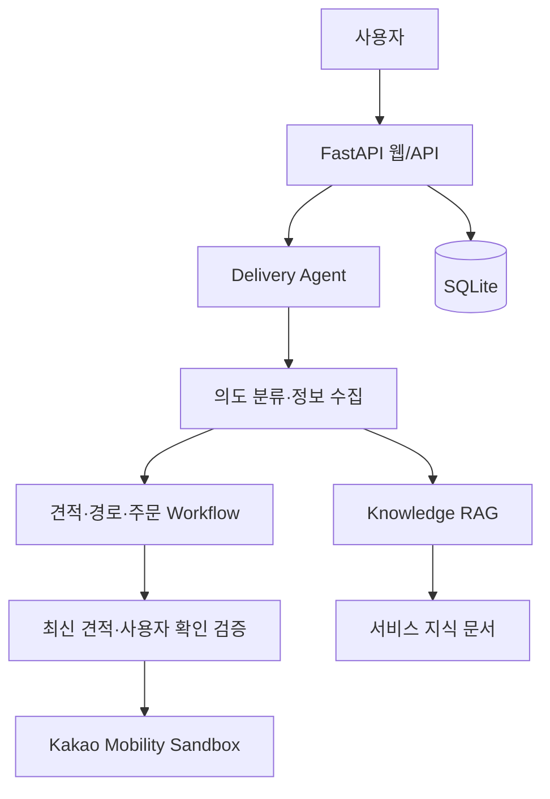

# MOVB

[](https://github.com/baek-seunghwan/ChatBot/actions/workflows/ci.yml)

MOVB는 자연어 기반 배송 접수와 운영 업무를 지원하는 FastAPI 웹 서비스입니다.
Kakao Mobility Quick/Walking Delivery Sandbox를 주문 계층으로 사용하며, LangGraph Agent와
근거 기반 Knowledge RAG를 결합해 질문 응답부터 견적, 주문, 상태 조회까지 연결합니다.

주문처럼 되돌리기 어려운 동작은 LLM이 직접 실행하지 않습니다. 서버 Workflow가 입력값,
최신 견적, 사용자 확인을 검증한 뒤에만 외부 API를 호출합니다.

## 핵심 기능

- **AI 배송 도우미**: 자연어 요청에서 배송 정보와 의도를 추출하고, 누락된 항목을 질문합니다.
- **근거 기반 안내**: 서비스 정책 문서를 BM25와 한국어 문자 n-gram으로 검색해 출처와 함께 답변합니다.
- **배송 접수와 추적**: 퀵·도보 배송 견적, 경로 요약, Sandbox 주문, 상태·Step 조회와 취소를 제공합니다.
- **스마트 딜리버리**: 같은 차량·비슷한 경로의 주문을 매칭해 단독 예상가, 최종가와 절약액을 비교한 뒤 참가자 결제 완료 시 하나의 배송으로 접수합니다. 이용자가 적을 때도 실제 매칭 로직을 검증할 수 있는 명시적 Sandbox 데모를 제공합니다.
- **운영 기능**: 이메일 인증, 역할 기반 관리자 화면, SQLite 기반 주문·콜백·대화 이력 저장을 제공합니다.

## 기술 구성

| 영역 | 구성 |
|---|---|
| Web/API | FastAPI, Uvicorn, 서버 렌더링 HTML |
| Agent | LangGraph, Anthropic, Gemini 폴백 |
| Retrieval | 자체 구현 BM25 + 문자 n-gram Knowledge RAG |
| 배송·지도 | Kakao Mobility Sandbox, Kakao Local, Kakao Navi |
| 저장소 | SQLite |
| 로컬 모델 (선택) | Ollama 또는 OpenAI 호환 vLLM 서버 |
| 배포 | Docker Compose, Render 호환 컨테이너 구성 |

## 아키텍처


```mermaid
flowchart TD
    user[사용자] --> web[FastAPI 웹/API]
    web --> agent[Delivery Agent]
    agent --> intent[의도 분류·정보 수집]
    intent --> rag[Knowledge RAG]
    intent --> delivery[견적·경로·주문 Workflow]
    delivery --> verify[최신 견적·사용자 확인 검증]
    verify --> kakao[Kakao Mobility Sandbox]
    web --> store[(SQLite)]
    rag --> docs[서비스 지식 문서]
```

## 빠른 시작

### 요구 사항

- Python 3.10 이상
- [uv](https://docs.astral.sh/uv/)
- 선택: Kakao Mobility, Kakao Developers, Anthropic 또는 Gemini API 키

```bash
git clone https://github.com/baek-seunghwan/ChatBot.git
cd ChatBot
cp .env.example .env
uv sync
uv run uvicorn mobility_service.app:app --reload --port 8002
```

실행 후 다음 주소를 사용할 수 있습니다.

| 주소 | 용도 |
|---|---|
| <http://127.0.0.1:8002> | 서비스 소개 |
| <http://127.0.0.1:8002/order> | 배송 접수 화면 |
| <http://127.0.0.1:8002/docs> | OpenAPI 문서 |
| <http://127.0.0.1:8002/health> | 상태 확인 |
| <http://127.0.0.1:8002/admin> | 관리자 화면 |

외부 API 키가 없어도 기본 화면, 로컬 QA, Knowledge RAG와 테스트는 실행할 수 있습니다.
실제 주소 변환, 경로, 배송 주문은 관련 Kakao API 키가 설정된 경우에만 사용할 수 있습니다.

## 환경 설정

`.env.example`을 `.env`로 복사한 뒤 필요한 통합만 설정합니다. `.env`에는 비밀 키나
개인정보를 커밋하지 않습니다.

```dotenv
# LLM: 하나만 설정해도 되며, 둘 다 설정하면 Anthropic 실패 시 Gemini를 사용합니다.
ANTHROPIC_API_KEY=
GEMINI_API_KEY=

# Kakao Mobility Quick/Walking Delivery Sandbox
KAKAO_MOBILITY_API_KEY=
KAKAO_MOBILITY_VENDOR_ID=
KAKAO_MOBILITY_CALLBACK_BASE_URL=

# Kakao 지도, 주소 변환, 길찾기
KAKAO_JAVASCRIPT_KEY=
KAKAO_REST_API_KEY=

# 관리자 초기 계정
MOVB_ADMIN_USERNAME=
MOVB_ADMIN_PASSWORD=
```

### 키 사용 범위

- `KAKAO_JAVASCRIPT_KEY`: 지도 SDK용 키입니다. 카카오 개발자 콘솔에 로컬 주소
  `http://127.0.0.1:8002`와 운영 도메인을 등록해야 합니다.
- `KAKAO_REST_API_KEY`: 서버에서 주소를 좌표로 변환하고 경로를 조회합니다. 브라우저에 노출하지 않습니다.
- `KAKAO_MOBILITY_API_KEY`, `KAKAO_MOBILITY_VENDOR_ID`: 배송 Sandbox 견적과 주문 API에 사용합니다.
- `KAKAO_MOBILITY_CALLBACK_BASE_URL`: 주문·Step 상태 콜백을 받을 공개 HTTPS 주소입니다. `localhost`는 사용할 수 없습니다.

카카오페이 개발 결제, Ollama, vLLM 등 선택 설정은 [.env.example](.env.example)에 전체 항목을 정리했습니다.

## API 개요

전체 요청/응답 스키마는 실행 중인 서버의 [/docs](http://127.0.0.1:8002/docs)에서 확인합니다.

| 메서드 | 경로 | 설명 |
|---|---|---|
| `POST` | `/api/agent/chat` | AI 및 로컬 채팅 통합 진입점 |
| `GET` | `/api/knowledge/search` | 지식 검색 결과와 근거 확인 |
| `POST` | `/api/deliveries/price` | 배송 가격 조회 |
| `POST` | `/api/deliveries/estimate` | 배송 ETA 조회 |
| `POST` | `/api/routes/summary` | 다중 경유지 경로 요약 |
| `POST` | `/api/orders` | 일반 배송 주문 생성 |
| `GET` | `/api/orders/{partnerOrderId}` | 주문 상태 조회 |
| `PATCH` | `/api/orders/{partnerOrderId}/cancel` | 주문 취소 |
| `POST` | `/api/smart-delivery/quote` | 스마트 딜리버리 비교 견적 |
| `POST` | `/api/smart-delivery/orders` | 스마트 딜리버리 주문 생성 |
| `POST` | `/api/delivery-matches` | 실사용자 스마트 딜리버리 매칭 대기·결제 금액 확정 |
| `POST` | `/api/delivery-matches/{request_id}/demo-match` | Sandbox 상대 주문으로 실제 매칭·할인 흐름 시연 |

주문 생성 API는 멱등성을 지원합니다. 스마트 딜리버리 주문은 서버에서 주소, 경로, 가격과
명시적 동의를 다시 검증합니다.

## 테스트와 평가

```bash
# 단위·통합 테스트
uv run python -m unittest discover -s tests -v

# Knowledge RAG 검색 평가
uv run python scripts/evaluate_mobility_knowledge.py --threshold 0.90
```

GitHub Actions는 `main` push와 Pull Request에서 위 두 검증을 실행합니다.
테스트는 Mock API를 사용하므로 실제 배송 주문을 생성하지 않습니다.

## Docker 실행

```bash
docker compose up --build
```

컨테이너는 `8002` 포트를 노출하고 주문·콜백 데이터는
`mobility_service/data` 볼륨에 유지합니다.

GPU 환경에서 vLLM을 함께 실행하려면 다음 Compose 구성을 사용합니다.

```bash
docker compose -f docker-compose.yml -f docker-compose.vllm.yml up -d
```

## 프로젝트 구조

```text
mobility_service/
├── app.py                  # FastAPI 라우트와 의존성 구성
├── agent.py                # LangGraph Agent와 배송 Workflow
├── bundle.py               # 스마트 딜리버리 견적·주문 변환
├── client.py               # Kakao Mobility Sandbox 클라이언트
├── directions.py           # 길찾기 및 경로 계획
├── knowledge.py            # Knowledge RAG 검색기
├── local_responder.py      # 로컬 QA, Ollama, vLLM 응답 경로
├── store.py                # 주문·콜백 SQLite 저장소
├── conversation_store.py   # 대화 상태 저장소
├── knowledge/              # 검색 근거 문서
└── *.html                  # 사용자·관리자 웹 화면
scripts/
├── crawl_movb_site.py      # 공개 문구 수집
└── evaluate_mobility_knowledge.py
tests/                      # API, Agent, RAG, 주문 흐름 검증
```

## 설계 원칙과 제약

- 주문 전에는 반드시 견적과 입력 정보를 확인하고, 사용자의 명시적 확인 뒤에만 주문합니다.
- 외부 LLM을 사용할 수 없으면 근거 문서와 로컬 QA를 사용해 제한된 응답을 제공합니다.
- Sandbox는 실제 기사 배정을 수행하지 않습니다. 운영 환경 전환에는 Kakao Mobility의 별도 심사와 연동이 필요합니다.
- 외부 API의 최신 요금, 법적 제한, 운영 정책은 지식 문서에 근거가 없으면 답변하지 않습니다.

## 참고 문서

- [서비스 구현·연동 세부](mobility_service/README.md)
- [Kakao Mobility 길찾기 API](https://developers.kakaomobility.com/guide/navi-api/start)
- [Kakao Mobility 배송 API](https://logistics-developers.kakaomobility.com/document/post-orders)
